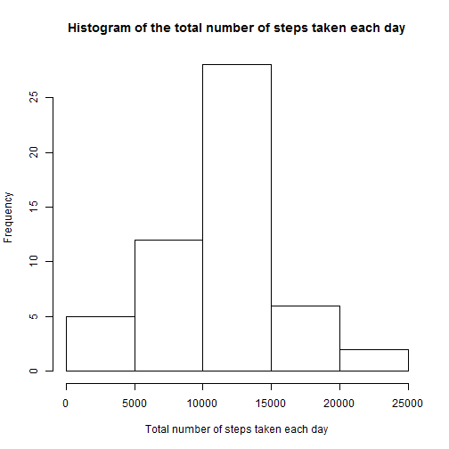
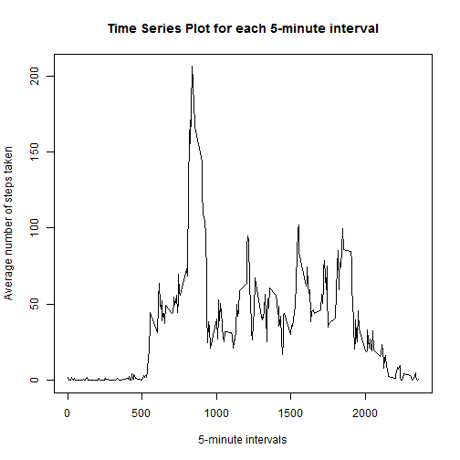
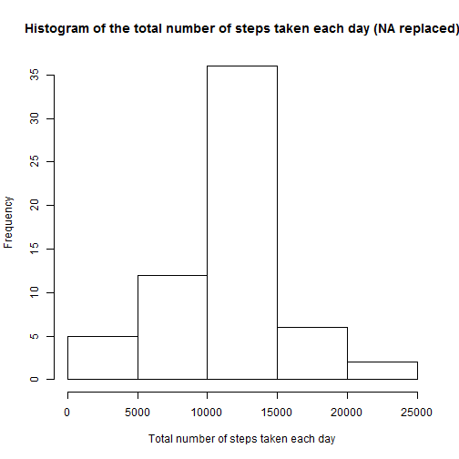
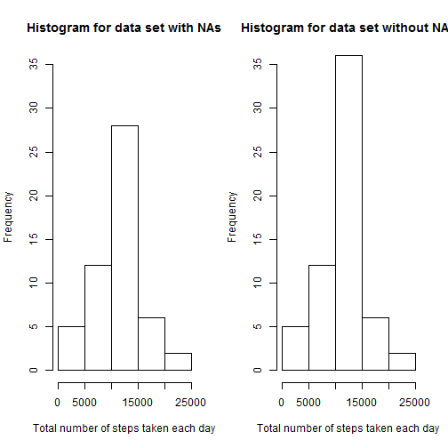
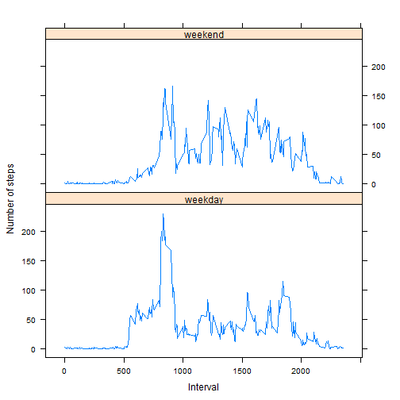

## Set global options for R markdown

## Install and load required packages

The following packages are needed for this R markdown file to work: lubridate, plyr, lattice.


```r
install.packages("plyr", repos='http://cran.us.r-project.org')
install.packages("lubridate", repos='http://cran.us.r-project.org')
install.packages("lattice", repos='http://cran.us.r-project.org')
require("plyr")
require("lattice")
require("lubridate")
```


## Loading and preprocessing the data

Before we unzip and read the data, we need to set the working directory to current directory:


```r
WD <- getwd()
if (!is.null(WD))
    setwd(WD)
```

We can now safely unzip and read the data:


```r
unzip("activity.zip")
data <- read.csv("activity.csv",stringsAsFactor=FALSE)
```

Change the date to POSIXct POSIXt format:

```r
data$date <- ymd(data$date)
```

## Part 1: What is mean total number of steps taken per day?

Before we start with the calculation, we remove all rows with missing values:


```r
data_full <- data[!is.na(data$steps),]
```

We need the sum of number of steps for each day (we keep only columns with the sum of steps and the date):


```r
data_p1 <- ddply(data_full,c("date"),numcolwise(sum))[,c(1,2)] 
```

Create a histogram plot of total number of steps taken each day:


```r
hist(data_p1$steps,
     main = "Histogram of the total number of steps taken each day",
     xlab = "Total number of steps taken each day")
```

 

Using the same data, we calculate the mean number of steps per day:


```r
mean(data_p1$steps)
```

```
## [1] 10766.19
```

And median number of steps per day:


```r
median(data_p1$steps)
```

```
## [1] 10765
```

## Part 2: What is the average daily activity pattern?

We first need to calculate the mean number of steps for each interval:


```r
data_p2_mean <- ddply(data_full,c("interval"),numcolwise(mean))
colnames(data_p2_mean) <- c("interval","mean.steps")
```

Using this data frame, we can create a time series plot of the 5-minute interval and average number of steps taken, averaged across all days:


```r
plot(data_p2_mean$interval, data_p2_mean$mean.steps, type = "l",
     main = "Time Series Plot for each 5-minute interval",
     xlab = "5-minute intervals",
     ylab = "Average number of steps taken")
```

 

The first column of this data frame holds the mean number of steps. The interval with the highest mean number of steps is:


```r
data_p2_mean[which.max(data_p2_mean$mean.steps),1]
```

```
## [1] 835
```

... with the mean number of steps:

```r
data_p2_mean[which.max(data_p2_mean$mean.steps),2]
```

```
## [1] 206.1698
```

## Part 3: Imputing missing values

The total number of missing values in the dataset:


```r
sum(is.na(data$steps))
```

```
## [1] 2304
```

We will replace all the missing values with the mean number of steps for respective interval (e.g. if we have a missing value for '10-1-2012' on interval '1550', we will replace this missing value with the mean number of steps value for this interval - calculated in part 2 of this assignment). We first merge the original data and data from part by the column interval:


```r
data_p3.missing <- merge(data,data_p2_mean,by="interval")
```

We sort it by date and interval and then replace all missing values with mean number of steps for that interval and round it as integer. We create a new data set (data_p3) by only using columns date, interval and steps.


```r
data_p3.missing <- data_p3.missing[with(data_p3.missing,order(date,interval)),]

data_p3.missing$steps[is.na(data_p3.missing$steps)]<- round(
        data_p3.missing$mean.steps[is.na(data_p3.missing$steps)],
        digits=0)

data_p3 <- data_p3.missing[, c(2,3,1)] # 2 - steps, 3 - date, 1 - interval
```

We then create a histogram of total number of steps taken each day:


```r
data_p3_hist <- ddply(data_p3,c("date"),numcolwise(sum))[,c(1,2)]

hist(data_p3_hist$steps,
     main = "Histogram of the total number of steps taken each day (NA replaced)",
     xlab = "Total number of steps taken each day")
```

 

The new mean number of steps per day, using the dataset with replaced NAs is:


```r
mean(data_p3_hist$steps)
```

```
## [1] 10765.64
```

... and it's median is:


```r
median(data_p3_hist$steps)
```

```
## [1] 10762
```

For easier comparison we also plot the histograms of dataset with removed NAs and dataset with replaced NAs, side by side:


```r
par(mfrow = c(1, 2))

hist(data_p1$steps,
     ylim = c(0,35),
     main = "Histogram for data set with NAs",
     xlab = "Total number of steps taken each day")

hist(data_p3_hist$steps,
     ylim = c(0,35),
     main = "Histogram for data set without NAs",
     xlab = "Total number of steps taken each day")
```

 

The histogram shows an over all very similar shape of columns as in part 1 but with higher frequency due to the NA being replaced in the new data set.
The Mean is equal to the estimates from part one of the assignment, since we only added mean values to data set.
The Median is slightly lower when compared to the first part of the assignment.


## Part 4: Are there differences in activity patterns between weekdays and weekends?

We create a new data set for part 4:


```r
data_p4 <- data_p3
```

We need to find out which days correspond to the dates in the data set. We do so by creating a new column named *day_of_week*, which is a factor with 7 levels ("Monday", "Tuesday", "Wednesday", "Thursday", "Friday", "Saturday", "Sunday").


```r
data_p4$day_of_week <- factor(format(data_p4$date, "%A"))
levels(data_p4$days_of_week)
```

```
## NULL
```

We then replace these levels with either weekday for c("Monday", "Tuesday", "Wednesday", "Thursday", "Friday") or weekend for c("Saturday", "Sunday").


```r
levels(data_p4$day_of_week) <- list(
    weekday = c("Monday", "Tuesday", "Wednesday", "Thursday", "Friday"),
    weekend = c("Saturday", "Sunday"))
```

We can now calculate the mean number of steps for each interval for each type of day of the week (i.e. either weekday or weekend).


```r
data_p4_mean <- ddply(data_p4,c("interval","day_of_week"),numcolwise(mean))
colnames(data_p4_mean) <- c("interval","day_of_week","mean.steps")
```

Once we construct the new dataset, we can plot the results.


```r
xyplot(data_p4_mean$mean.steps ~ data_p4_mean$interval | data_p4_mean$day_of_week,
       layout = c(1, 2),
       type = "l",
       xlab = "Interval", 
       ylab = "Number of steps")
```

 
